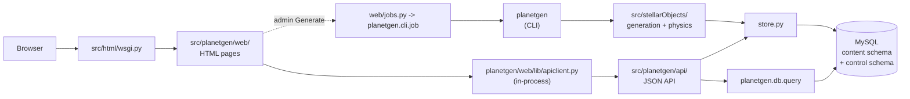
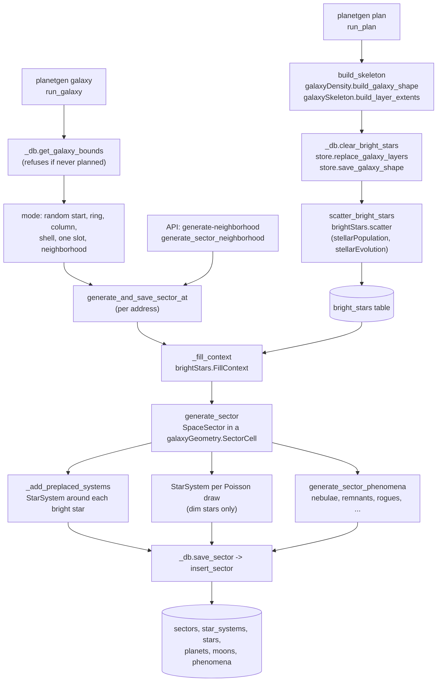
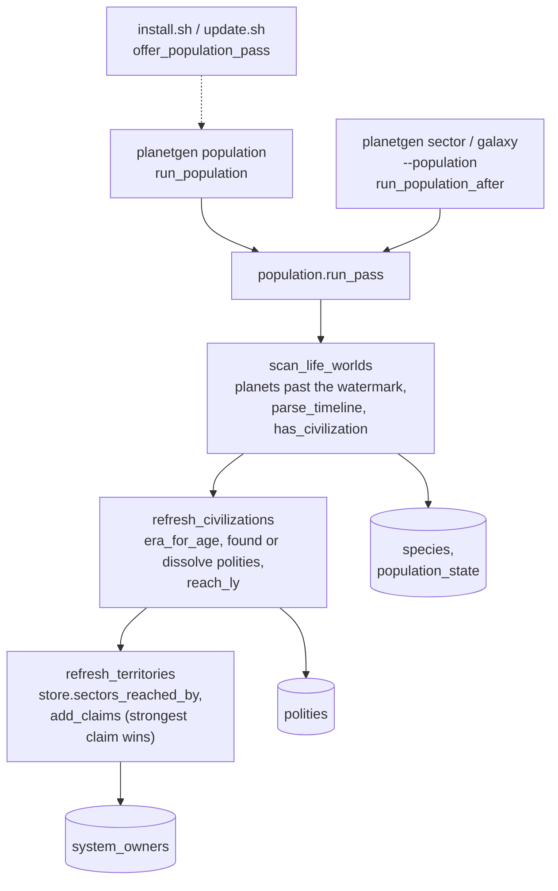
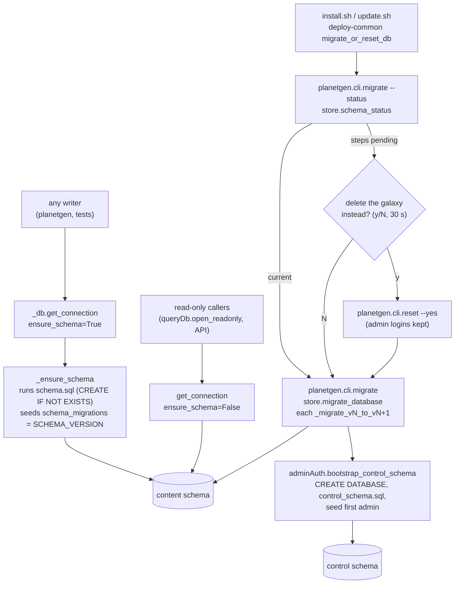
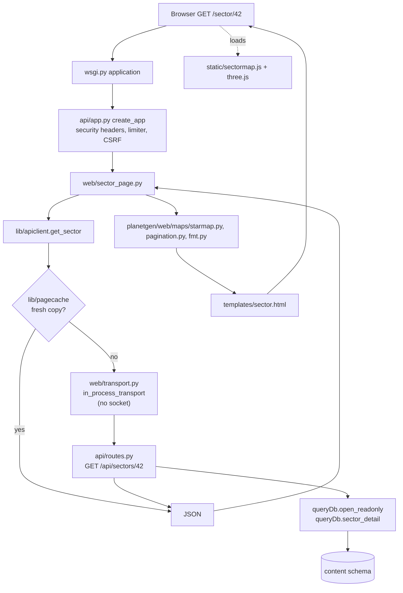
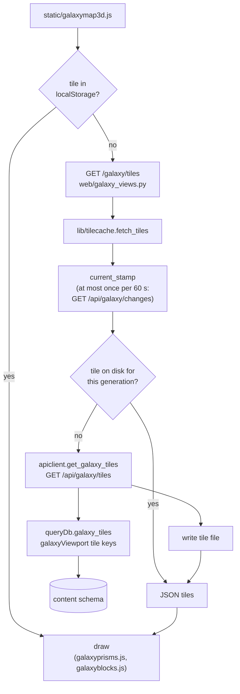
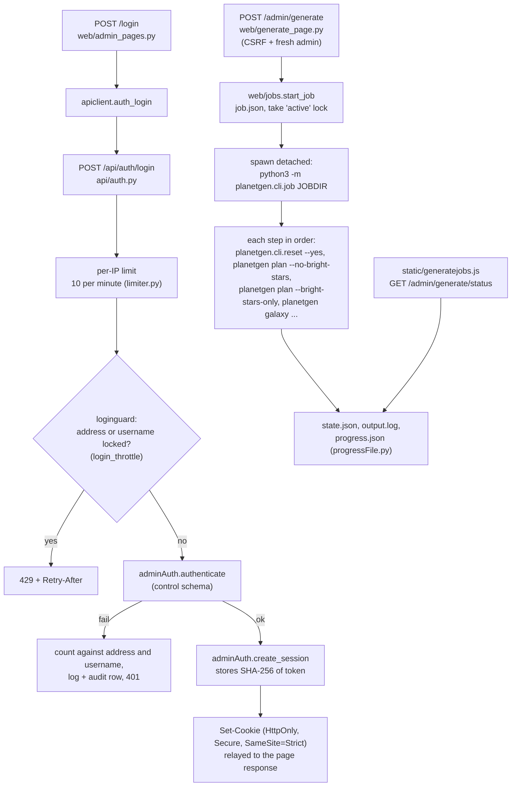
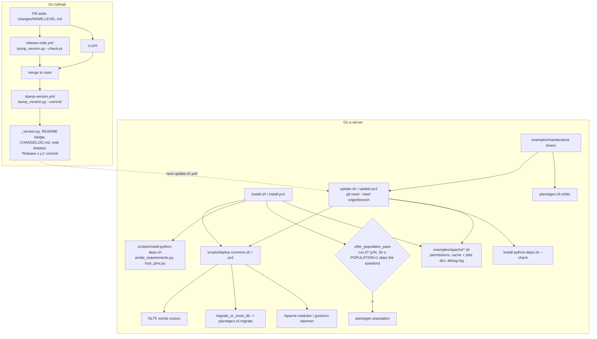

# Architecture: how planetGen fits together

This document is the map of the program. It says which file holds what,
and it traces the main flows (generating a galaxy, storing it, serving it,
running admin jobs, shipping a release) through those files. Use it to
find where something lives before you open the code.

It does not repeat the reference docs. For details, follow the links:
[api.md](../api.md) (the JSON API), [database-schema.md](../database-schema.md)
(tables and columns), [html-interface.md](../html-interface.md) (the web
pages), [config.md](../config.md) (`config.json`), [testing.md](../testing.md)
(the test suite) and [deployment/](../deployment/README.md) (servers).
The other files in this folder are topic designs; they explain why a part
works the way it does.

**Keeping it current.** A PR that adds, moves, renames or removes a module,
script, workflow or top-level folder updates this file in the same PR. If a
flow below changes shape (a new step, a new cache, a new process), update
its diagram too. Each module's own docstring stays the detailed source of
truth; this file only needs one line per module.

**Planned restructuring (2026-10-07).** The code is to be reorganized
into importable packages and moved onto third-party libraries (RQ on
Redis for the queue, SQLAlchemy and Alembic for the database, and
others); see [library-migration.md](library-migration.md). Until those
land, the map below describes the code as it is.

## Contents

- [The big picture](#the-big-picture)
- [Map of the repository](#map-of-the-repository)
  - [Top level](#top-level)
  - [scripts/](#scripts)
  - [examples/](#examples)
  - [src/stellarObjects/](#srcstellarobjects)
  - [src/ command-line tools](#src-command-line-tools)
  - [src/planetgen/wiki/](#srcplanetgenwiki)
  - [src/html/](#srchtml)
  - [src/tests/](#srctests)
  - [.github/workflows/ and changes/](#githubworkflows-and-changes)
- [Flow 1: generating a galaxy](#flow-1-generating-a-galaxy)
- [Flow 2: storing and migrating the database](#flow-2-storing-and-migrating-the-database)
- [Flow 3: serving a page and a map](#flow-3-serving-a-page-and-a-map)
- [Flow 4: admin login and background Generate jobs](#flow-4-admin-login-and-background-generate-jobs)
- [Flow 5: install, update and releases](#flow-5-install-update-and-releases)

## The big picture

planetGen has three layers that share one Python package:

1. **Generation.** `planetgen` and the `src/stellarObjects/` package
   build stars, planets, sectors and whole galaxies from physics models
   and random draws.
2. **Storage.** `src/planetgen/db/store.py` writes those objects into a
   MySQL database (`schema.sql`), reads them back, and migrates old
   databases forward. A second, separate schema (`control_schema.sql`)
   holds admin logins.
3. **Serving.** One Flask app (`src/html/`) serves both the JSON API
   (`/api/...`) and the HTML pages. The pages never query the database
   themselves; they call the API in-process through `planetgen/web/lib/apiclient.py`,
   and the API reads through `planetgen.db.query` and `store.py`.

Around those sit the installers (`install.sh`, `update.sh` and their
Windows twins), maintenance tools (`planetgen.cli.orbits`,
`planetgen.cli.migrate`, ...), the tests, and the release workflows.

## Map of the repository

### Top level

| Path | What it holds |
|---|---|
| [`planetgen`](../.planetgen) | The single generation CLI, with six subcommands: `system`, `sector`, `galaxy`, `plan`, `phenomenon` and `population` (the population and politics pass over what is stored). `sector` and `galaxy` also run that pass after saving, but only with `--population`. Also the library functions other code calls: `generate_sector`, `ensure_sector_generated`, `generate_sector_neighborhood`, `build_skeleton`, `scatter_bright_stars`, `backfill_bright_stars`. Installed as the `planetgen` console script (`setup.py`). |
| [`install.sh`](../../install.sh) | One-shot installer for Linux (Apache with mod_wsgi) and macOS (gunicorn under launchd, nginx in front): Python libraries, NLTK corpus, `planetgen.cli.migrate`, the optional population pass prompt, Apache modules or the gunicorn daemon, permissions, tile cache and jobs directories, debug log. |
| [`update.sh`](../../update.sh) | `git reset --hard` to the branch tip, then the same checks as `install.sh`, changing only what is missing, but never the population pass (run `planetgen population` by hand). Safe to run on a schedule. |
| [`install.ps1`](../../install.ps1), [`update.ps1`](../../update.ps1) | The Windows counterparts: a venv with waitress, the same steps, the layout of [deployment/windows.md](../deployment/windows.md). `install.ps1 -Population` runs the population pass without asking. |
| `setup.py`, `pyproject.toml` | The Python package (`stellarObjects`, `generate`) and its dependency floors and extras (`api`, `test`, `browser`). |
| `requirements.lock`, `requirements-server.lock` | Hash-pinned dependency locks, written by `scripts/lock-requirements.sh`. |
| `config.json.example` | Template for the per-deployment `config.json` (gitignored). See [config.md](../config.md). |
| `pytest.ini` | Puts `.`, `src` and `src/html` on the path for the tests. |
| `CHANGELOG.md`, `README.md` | Release history and the project front page. Both are stamped by the release flow, never edited for the version by hand. |
| `changes/` | Pending release notes, one file per PR. See [Flow 5](#flow-5-install-update-and-releases). |
| `docs/` | Reference docs, `design/` topic designs, `analysis/` reviews, `deployment/` server guides, `TODO.md` (open work) and `plan/` (one plan per phase of it). |

### scripts/

| Path | What it holds |
|---|---|
| [`scripts/deploy-common.sh`](../../scripts/deploy-common.sh) | Steps shared by `install.sh` and `update.sh` (sourced by both; `offer_population_pass` is the installer's alone): pick the Python, NLTK corpus, Apache modules or gunicorn launchd daemon, mod_wsgi check, import check, and `migrate_or_reset_db` (the y/N "delete the galaxy instead?" prompt), and `offer_population_pass` (the y/N "run the population pass now?" prompt, default No after 30 seconds, skipped with no terminal; `POPULATION=1` runs it without asking). |
| [`scripts/deploy-common.ps1`](../../scripts/deploy-common.ps1) | The same shared steps for `install.ps1` and `update.ps1` (the population prompt is `Invoke-OptionalPopulation`). |
| [`scripts/install-python-deps.sh`](../../scripts/install-python-deps.sh) | Makes the libraries importable by the system Python: plain pip, or apt first on an externally managed (PEP 668) Python, or a venv on macOS. `--check` installs only what is missing or too old. |
| `scripts/probe_requirements.py` | Reports each requirement as ok, missing, old or broken. Used by both installers. Standard library only. |
| `scripts/lock_pins.py` | Reads `requirements.lock` for `install-python-deps.sh` (constraints, resolve). Standard library only. |
| `scripts/lock-requirements.sh` | Rewrites `requirements.lock` with `uv`. Run by a developer after changing a requirement, never on a server. |
| [`scripts/bump_version.py`](../../scripts/bump_version.py) | Turns `changes/` notes into releases: bumps `_version.py`, the README badge and `CHANGELOG.md` together. Also the PR check (`--check-pr`). |

### examples/

Copy-and-edit configuration for each kind of server. The guides in
[deployment/](../deployment/README.md) say which files to use.

| Path | What it holds |
|---|---|
| `examples/apache/` | The Apache vhost (`planetgen.conf.example`) and the helpers `install.sh`/`update.sh` call: `set-permissions.sh`, `create-cache-dir.sh` (tile cache and jobs directories, via `deploy-paths.py`), `setup-debug-log.sh`, `apache-identity.sh`. |
| `examples/nginx/`, `examples/caddy/` | Reverse-proxy configs for gunicorn or waitress behind nginx or Caddy. |
| `examples/macos/` | launchd plists (gunicorn, orbit update, update) and the Homebrew nginx config. |
| `examples/systemd/` | The gunicorn service and a drop-in that reloads the web server after an update. |
| `examples/windows/` | IIS (`web.config`), Caddy, Apache Lounge, waitress service wrapper and the orbit-update task. |
| `examples/maintenance/` | Scheduled maintenance: systemd timers and units for `planetgen.cli.orbits` (per database) and `update.sh`, `install-maintenance-timer.sh` (also makes launchd daemons on macOS) and the Windows `install-maintenance-task.ps1`. |
| `examples/systems/` | Sample system files for `planetgen system --system-file` (Solar System, Tatooine, ...). See [example-systems.md](../example-systems.md) and [system-file-format.md](../system-file-format.md). Checked by `test_examples.py`. |

### src/stellarObjects/

The core package. Generation code works in natural units and knows
nothing about the database; `store.py` is the one place that converts and
stores. The groups below are by role, not by folder (the package is flat).

#### Systems, stars and bodies

| Path | What it holds |
|---|---|
| [`systemData.py`](../../src/stellarObjects/systemData.py) | `StarSystem`: builds a whole system (star or binary, planets, moons, belts, comets, life data) and renders it as wikitext or Markdown (`__str__`). |
| [`starData.py`](../../src/stellarObjects/starData.py) | `Star`: mass, radius, temperature, luminosity, habitable zone, Hill sphere, galactic orbit. |
| `doubleStar.py` | `BinaryStarProxy`: a close (P-type) binary treated as one central star for planet generation. |
| `wideBinary.py` | `WideBinaryPair`: a wide (S-type) binary where each star keeps its own planets. |
| `compactRemnant.py` | `BlackHole` and `NeutronStar`, which can anchor a system in place of a `Star`. |
| [`planetData.py`](../../src/stellarObjects/planetData.py) | `Planet`: one planet or moon, its state and its description text. |
| [`planetPhysics.py`](../../src/stellarObjects/planetPhysics.py) | What a planet physically is: zone, class, radius, mass, atmosphere, temperature, moons, orbital position. |
| `planetLife.py` | Whether and how life arises (biochemistry, evolution speed, timeline). Applied after the whole system exists. |
| `evolution.py` | The speculative evolutionary timeline text for a habitable planet. |
| `asteroidData.py` | `AsteroidBelt` and the shared composition helpers. |
| `cometData.py` | `Comet`: a star-bound comet on a real Kepler orbit. See [comet-orbital-realism.md](comet-orbital-realism.md). |
| `keplerMotion.py` | Kepler/Barker orbit propagation for eccentric and parabolic orbits. |
| `facilities.py` | Starbases, colonies and outposts: placement rules and orbit math (schema v42). |
| `config.py` | `SystemConfig`: every generation option (mostly tri-state flags), from the CLI or a system file. |
| `serialization.py` | The allowlist `to_dict`/`from_dict` helpers the classes above share. |

#### Star population

| Path | What it holds |
|---|---|
| `stellarEvolution.py` | Draws a star as physics: Kroupa IMF mass, age from the star-formation history, evolved state (main sequence through remnant). |
| `stellarPopulation.py` | The population model split at a luminosity threshold: bright stars for plan time, dim stars for sector fill. |
| [`brightStars.py`](../../src/stellarObjects/brightStars.py) | Galaxy-wide bright-star scatter after `planetgen plan` (ring by ring, into `bright_stars`), the per-block backfill around each generated sector (`backfill_cells`, GEN.23), and `FillContext`, which a sector fill uses to build systems around its pre-placed stars. |

#### Exotic phenomena (outside any system)

| Path | What it holds |
|---|---|
| `nebulaData.py` | `Nebula`. See [nebula-and-asteroid-field-classes.md](nebula-and-asteroid-field-classes.md). |
| `asteroidFieldData.py` | `AsteroidField`: asteroid debris in open space. |
| `supernovaRemnantData.py` | `SupernovaRemnant`. |
| `roguePlanetData.py` | `RoguePlanet` and `InterstellarComet`. See [interstellar-object-rates.md](interstellar-object-rates.md). |
| `quasarData.py` | `Quasar`: the galaxy's active nucleus, only ever at the center sector. |

#### Sectors and galaxy geometry

| Path | What it holds |
|---|---|
| [`spaceSector.py`](../../src/stellarObjects/spaceSector.py) | `SpaceSector` and `SectorSystemEntry`: a region of space holding placed systems and phenomena, with Hill-sphere spacing. |
| [`galaxyGeometry.py`](../../src/stellarObjects/galaxyGeometry.py) | The cylindrical sector grid: ring, layer and slot addresses, `SectorCell`, sector positions, neighbors, designations. See [galaxy-coordinate-system.md](galaxy-coordinate-system.md). |
| [`galaxyDensity.py`](../../src/stellarObjects/galaxyDensity.py) | The disk, bulge and spiral-arm density model (`GalaxyShape`, `relative_density`). See [galaxy-disk-density.md](galaxy-disk-density.md). |
| `galaxySkeleton.py` | The galaxy's outline: which layers hold content and how far out each reaches. Stored by `planetgen plan`. |
| `galaxyViewport.py` | The Galaxy Map's data layer: cube tile keys and what each tile holds. |
| `galaxyDrill.py` | The Galaxy Map's drill-down block ladder (243, 27, 3, 1 sectors a side). Mirrored in `static/galaxyprisms.js`. See [galaxy-drilldown-navigation.md](galaxy-drilldown-navigation.md). |

#### Navigation

| Path | What it holds |
|---|---|
| `navigation.py` | Pure math for NAV: course (distance, bearing, mark) and warp/fold travel times. See [navigation-frames.md](navigation-frames.md). |
| `navGraph.py` | k-nearest-neighbor graph and Dijkstra shortest route between systems. |

#### Population and politics

| Path | What it holds |
|---|---|
| [`population.py`](../../src/stellarObjects/population.py) | The population pass (schema v44): names the dominant species of each life world, gives technological civilizations an age and an era, founds one polity per spacefaring species, and splits the generated systems around them into territories. Works only from stored rows (the planets' evolution text and the systems' positions), so it runs on a galaxy generated before it existed. `run_pass` is the entry point; `population_status` and the `list_*`/`*_detail`/`territory_points` readers back the API. Optional and off by default. See [population-and-politics.md](population-and-politics.md). |

#### Naming

| Path | What it holds |
|---|---|
| `names.py`, `offensive_words.txt` | Name word lists and the blocklist used to reject generated names. |
| `utils.py` (name part) | `generate_phoneme_salad_name`, `generate_sector_name`, `is_name_valid`. |
| `nameUniqueness.py` | Pure functions that decorate a colliding sector or system name (Greek/Roman suffixes, diminutives). `store.py` applies them on insert. A new star system name stays within two words (`MAX_SYSTEM_NAME_WORDS`): a decoration that would add a third is skipped and a fresh name drawn. |
| `bodyNames.py` | Names stars, planets and moons from their system's name (`Voranthis II`, `Voranthis IIa`). |

#### Persistence

| Path | What it holds |
|---|---|
| [`store.py`](../../src/stellarObjects/store.py) | Everything that touches MySQL for writing and full-object reading: connection pools (`get_connection`, `open_write`, `get_control_connection`), `save_system`/`save_sector`/`save_phenomenon`, every `insert_*`, `add_system_to_sector` (a new system placed clear of a stored sector's Hill spheres) and `replace_star_system_content` (regenerate a system in place, keeping its id, name and links), name reservation, containment and nearest-neighbor refresh, the galaxy skeleton and bright-star tables, `load_star_system`/`load_sector`, orbit advancement, and every `_migrate_vN_to_vN+1` step plus `migrate_database`. `SCHEMA_VERSION` lives here. |
| [`schema.sql`](../../src/planetgen/db/schema.sql) | The content schema DDL (one database per galaxy). Its header notes record what each schema version changed. See [database-schema.md](../database-schema.md). |
| [`control_schema.sql`](../../src/planetgen/db/control_schema.sql) | The control schema: admin users, sessions, API keys, audit log. One per deployment, versioned separately. |
| `adminAuth.py` | Password hashing, sessions, API keys, credential rotation, audit log, and `bootstrap_control_schema` (creates the control schema and seeds the first admin). |
| `render.py` | Renders a stored system's page text (wikitext or Markdown) on demand from the database rows. No page text is stored since schema v29. |

#### Shared infrastructure

| Path | What it holds |
|---|---|
| `physical_constants.py` | Real physical and astronomical constants and unit conversions. |
| `program_constants.py` | Design and tuning constants and the big data tables (planet classes, life chemistry, flavor text, facility rules, sector edge). |
| `generationLimits.py` | Upper bounds on admin inputs, shared by the CLI, the API and the Generate pages. |
| `utils.py` | Math, formatting (distance ladder, scientific notation), name generation and `properties_to_string`. |
| `appconfig.py` | Loads `config.json`; the `PLANETGEN_*` environment variables override it. |
| `log.py` | The one logging channel (`--debug`/`--quiet`/`--silent`, the debug log file). |
| `progressFile.py` | Writes `progress.json` for a web-started run when `PLANETGEN_PROGRESS_FILE` is set. |
| `plausibility.py`, `phenomenaPlausibility.py` | Anomaly finders: hard invariants (gated in tests) and statistical reviews (CLI wrappers in `src/tests/`). |
| `_version.py` | `__version__`, kept dependency-free so `setup.py` can read it. Stamped by the release flow. |
| `__init__.py` | Re-exports the public classes (`Star`, `Planet`, `StarSystem`, `SpaceSector`, ...). |

### src/ command-line tools

Each is run as `python3 -m planetgen.cli.<name>`. They read the database settings
from `config.json` or `PLANETGEN_MYSQL_*`, like every entry point.

| Path | What it holds |
|---|---|
| `planetgen.db.query` | The read layer and a list/query CLI. `open_readonly`, the listings, `sector_detail`/`system_detail`, `search`, `nav_between`, every Galaxy Map query (`galaxy_tiles`, `galaxy_stage`, `galaxy_content_stamp`, `galaxy_changes`, `galaxy_locate` for the address bar), and the bright-star reads (`bright_star_scatter_status`, `bright_stars_in_sector`, `galaxy_bright_stars_in_box` with `unfilled_only`). The API's read routes call these. |
| `planetgen.cli.migrate` | Brings the content database to the current schema (`store.migrate_database`, with a progress bar), then bootstraps the control schema. `--status` reports without changing anything. Run by the installers. |
| `planetgen.cli.reset` | Empties every generated table (`TRUNCATE`), keeping the schema and its version. |
| `planetgen.cli.orbits` | Advances every orbit and galactic position by the real time elapsed since the last run. Meant for a monthly timer. |
| `planetgen.cli.job` | Runs one admin Generate job's steps in order, writing `state.json` and `output.log`, honoring the `cancel` file. |
| `planetgen.db.stats` | Read-only statistics about a database (table sizes, schema version, decorated names, `bright_star_counts`) for the admin stats page. |
| `planetgen.cli.dedupe` | One-off backfill that resolves duplicate sector and system names in an older database. |
| `planetgen.cli.render_parity` | One-off pre-v29 check that on-demand rendering matches the stored page text. |

### src/planetgen/wiki/

Publishes a page to Wiki.js or MediaWiki behind one `WikiClient` object.
Used by the API's "Upload to Wiki" routes.

| Path | What it holds |
|---|---|
| `client.py` | `WikiClient`: dispatches to the backend named at construction. |
| `wikijs.py`, `mediawiki.py` | The two backends (GraphQL with an API token; Action API with a bot password). Standard library only. |
| `base.py`, `exceptions.py` | The shared result type, backend interface and exception hierarchy. |

### src/html/

One Flask app. `wsgi.py` is the entry point, `api/` is the JSON API, `web/`
is the HTML pages, `lib/` is shared page-building code, `static/` is what
the browser loads.

#### Entry point

| Path | What it holds |
|---|---|
| [`src/html/wsgi.py`](../../src/html/wsgi.py) | The WSGI `application` for mod_wsgi, gunicorn and waitress. Puts `src/html` and `src` on `sys.path`, calls `create_app()`, and undoes an older `/api` mount prefix. |

#### src/planetgen/api/

| Path | What it holds |
|---|---|
| [`app.py`](../../src/planetgen/web/app.py) | `create_app`: registers the API blueprints (`routes`, `auth`, `admin`, `population`), calls `web.init_app`, the rate limiter, proxy fix, security headers, request logging and the error handlers (JSON under `/api`, HTML pages elsewhere). |
| [`routes.py`](../../src/planetgen/api/routes.py) | Every `/api/...` content route: databases, sectors, systems (detail, text, sections, near), nav, `/api/galaxy/*` (sectors, phenomena, shape with its `bright_stars` status, cell, tiles, stage, stamp, changes, locate), phenomena, search, facilities, and the admin writes (edit, delete, generate-neighborhood, wiki upload, `POST /api/systems` with an optional `sector_id` to add a system to a stored sector, `PATCH /api/systems/<id>` with `regenerate` to rebuild one in place). |
| [`population.py`](../../src/planetgen/api/population.py) | Its own blueprint for the population read routes: `/api/population` (status), `/api/species`, `/api/polities`, `/api/systems/<id>/owner`, `/api/planets/<id>/species`, `/api/territories`. Backed by `planetgen/population/model.py`; shares `routes.py`'s connection and pagination. |
| `auth.py` | `/api/auth/*`: login, logout, me, change-credentials, API keys. Sets the session cookie. |
| `authz.py` | Resolves the calling admin from the session cookie or a Bearer API key; the `require_admin` decorator; audit helper. |
| `loginguard.py` | The checks around every password check: the per-address lockout and per-username backoff (`planetgen/admin/throttle.py`, kept in the control database's `login_throttle`, in memory only while that table is missing), and the log line and audit row for each refused sign-in. |
| `admin.py` | `/api/admin/stats` and `/api/admin/duplicate-names` (backed by `planetgen.db.stats`), `/api/admin/login-failures`, and `/api/admin/lockouts` (list and lift). |
| `limiter.py` | The shared Flask-Limiter instance and per-page limits; in-process calls from the pages skip the default limits. |
| `config.py` | API configuration: the MySQL config, cookie and rate-limit settings, from `config.json` and the environment. |
| `common.py` | `ApiError` and the control-schema connection, shared by `routes.py` and `auth.py` without an import cycle. |

#### src/planetgen/web/

| Path | What it holds |
|---|---|
| [`__init__.py`](../../src/planetgen/web/__init__.py) | The pages blueprint and `init_app`: installs the in-process transport, the CSRF check and Jinja settings, builds the class reference catalog (`classref.catalog()`) at startup, and gives the app its page cache (`_install_page_cache`, see Flow 3). |
| `views.py` | `/` (home), `/sectors`, `/systems`, `/search`. |
| `searchpage.py` | Search page request parsing and URL building. |
| `sector_page.py` | `/sector/<id>`: Sector Map, contents table (with octants, nearest systems and facilities), admin actions (wiki upload, generate neighborhood), and the NAV pick mode (`?pick=from` or `?pick=to`, a "Choosing a destination" banner and "Use as destination" links). |
| `system_pages.py` | `/system/<id>`, `/phenomena`, `/phenomenon/<type>/<id>`. Links class labels to `/classes`; hands a facility POST to `system_facilities.py`. |
| `system_facilities.py` | The system page's Facilities panel and the admin facility form: `preview` (placement rules and orbit, nothing saved), `save` (`POST /api/facilities`) and `remove` (`DELETE /api/facilities/<id>`). |
| `class_pages.py` | `/classes`, `/classes/<type>` and `/classes/<type>/<code>`, from `planetgen/web/lib/classref.py`; `class_url` for the pages that link a class. |
| `galaxy_views.py` | `/galaxy` (the 3D Galaxy Map page and Quadrant tables; `?course=<from>,<to>` draws a NAV course), `/galaxy/tiles` and `/galaxy/stage` (JSON the map script fetches, through the tile cache), `/galaxy/locate` (the address bar's name lookup) and `/galaxy/territories` (the Territories overlay; its button shows only once a polity exists). |
| `nav_page.py` | `/nav`: pick two endpoints, show course, route and NAV map, with "Show on Galaxy Map" (`galaxy_course` builds the course's waypoints for `/galaxy?course=`). |
| `admin_pages.py` | `/login`, `/logout`, `/account`, `/admin` (API keys, wiki links), `/admin/stats`. |
| `generate_page.py` | `/admin/generate` (new galaxy, plan, generate sectors, reset), `/admin/generate/status`, `/admin/generate/jobs/<id>`. |
| `system_page.py` | `/admin/generate/system`: a one-off system shown on the page, never saved (runs `planetgen system --output`). |
| `jobs.py` | Background job directories, the one-job lock, spawning `planetgen.cli.job` detached, cancel, listing. |
| `transport.py` | The in-process transport that lets `apiclient` call the API routes without a socket. |
| `helpers.py` | `render_page`, `db_name`, `page_url`, breadcrumbs, `current_admin`, `generate_target`. |
| `csrf.py` | Signed double-submit CSRF protection for every page POST. |
| `errors.py` | HTML error pages (404, 502, 500 without tracebacks). |
| `old_urls.py` | 301 redirects from the old CGI `/<name>.py` URLs. |
| `templates/` | Jinja2 templates, one per page, all extending `base.html` (including `classes.html`, `class_type.html`, `class.html`); `partials/` holds shared fragments. |

#### src/planetgen/web/lib/ and src/planetgen/web/maps/

Names without a folder are in `src/planetgen/web/lib/`; `maps/` names are in `src/planetgen/web/maps/`.

| Path | What it holds |
|---|---|
| [`apiclient.py`](../../src/planetgen/web/lib/apiclient.py) | The API client every page uses: in-process inside Flask (via `web/transport.py`), over HTTP (`api_base_url`) anywhere else. |
| [`tilecache.py`](../../src/planetgen/web/lib/tilecache.py) | On-disk cache of Galaxy Map tiles and drill stages, invalidated by `/api/galaxy/changes`. |
| [`pagecache.py`](../../src/planetgen/web/lib/pagecache.py) | In-memory cache of the API's public GET answers for the pages (PERF.2): cleared by any API write in the process, checked against the galaxy content stamp, capped by age and size. `page_cache` in `config.json`; `PLANETGEN_PAGE_CACHE=off` turns it off. |
| `classref.py` | The class reference catalog behind `/classes`, built once per process from the generator's own tables, never hand-copied. |
| `maps/galaxymap3d.py` | Builds the Galaxy Map panel and its first embedded tiles. |
| `maps/galaxymap.py` | Quadrant and Zone classification of sectors. |
| `maps/starmap.py` | Data for the 3D Sector Map (systems, phenomena, neighbor indicators). |
| `maps/systemmap.py` | The System Map: a top-down SVG of real body positions. |
| `systempage.py` | The system page's body list and data tables. |
| `maps/phenomenonmap.py` | A phenomenon's AU-scale SVG diagram (now only for nebulae and supernova remnants). |
| `maps/phenomenonrender.py` | The phenomenon page's View panel: which view suits each type (`view_kind`), the numbers for the three.js render, and a static SVG still for no JavaScript. Asteroid fields get no view. |
| `maps/navmap.py` | The NAV page's top-down SVG of origin, destination and route. |
| `tabledisplay.py` | Star and planet display strings computed from raw columns. |
| `mdconvert.py` | Converts the generator's narrow Markdown subset to HTML. |
| `pagination.py` | The site's one pager. |
| `fmt.py` | Escaping and formatting helpers (`esc`, distances, UTC times). |
| `privatedir.py` | Safe private fallback directories in the system temp folder. |

#### src/html/static/

| Path | What it holds |
|---|---|
| [`galaxymap3d.js`](../../src/html/static/galaxymap3d.js) | The 3D Galaxy Map (three.js): scene, the Free look camera, tile fetching from `/galaxy/tiles`, `localStorage` tile cache, bright stars and clouds, the NAV course line and the Territories overlay. Hands the drill-down to `galaxystageview.js`. |
| `galaxystages.js` | The drill-down's stage rules with no drawing: which blocks a stage holds, stage URLs (`?slab=`, `?at=`, `?sector=`), breadcrumb, labels, the flight path. No three.js import; tested under node. |
| `galaxystageview.js` | The drill-down drawn and driven: the eight stages from galaxy to sector, camera flights, breadcrumb with sibling menus, slab slider, tooltip, keys, touch, and the address bar. Created by `galaxymap3d.js`, which opens on it. |
| `galaxyprisms.js` | Sector-grid prisms, block level of detail, density shading and the `drill*` ladder rules (mirrors `galaxyGeometry.py` and `galaxyDrill.py`). No three.js import, so tests run it under node. |
| `galaxyblocks.js` | Builds the block scene's typed arrays, in a Web Worker when it can. |
| `sectormap.js` | The 3D Sector Map (three.js). |
| `systemmap.js` | System Map clicks, moon drill-in and the 3D body spheres. |
| `bodyRendering.js` | Shared three.js sphere, glow and granulation helpers for the two maps above and the phenomenon view. |
| `generatebuttons.js` | Admin "Generate" forms on an ungenerated sector (Sector Map and Galaxy Map); Generate neighborhood asks for a radius in light years (13 to 652) and estimates the sector count. |
| `phenomenonrender.js` | The phenomenon View panel's three.js render (neutron star beams, accretion disks, rogue planet, comet), one still frame under reduced motion. |
| `generatejobs.js` | Live progress of the current Generate job (polls `/admin/generate/status`). |
| `mapzoom.js`, `phenomenonmap.js` | Shared SVG viewBox zoom/pan, and its use on the phenomenon diagram. |
| `distance.js` | The browser copy of the distance ladder (`format.format_distance_m`). |
| `numberformat.js` | The browser copy of `format.format_number` (scientific notation past 4 whole digits). |
| `localtime.js` | Rewrites UTC times into the viewer's time zone. |
| `theme.js` | Light/dark/system theme switch and header menu closing. |
| `copycode.js` | The system page's Copy button. |
| `style.css`, `favicon.svg` | Site styles (CSS tokens for both themes) and icon. |
| `vendor/` | Vendored three.js and its license notices. |

### src/tests/

Run with `pytest` from the repo root. Database tests need MySQL and skip
without it. See [testing.md](../testing.md).

| Path or pattern | What it holds |
|---|---|
| `conftest.py` | The `mysql_config` fixture: a throwaway database per test. |
| `webpage_support.py`, `bughunt_support.py`, `fuzz_support.py` | Shared fixtures: a live API on a background thread, bug-hunt helpers, Hypothesis profiles (`ci`, `deep`). |
| Generation: `test_systems.py`, `test_planets.py`, `test_moons.py`, `test_star_*.py`, `test_wide_binary.py`, `test_evolution.py`, `test_comet_data.py`, `test_phenomena*.py`, `test_quasar.py`, `test_facilities.py`, `test_*_motion.py`, `test_heliosphere_model.py`, ... | Unit and behavior tests for one generation module each. |
| Galaxy: `test_galaxy_*.py`, `test_galaxydrill.py`, `test_galaxyprisms.py`, `test_galaxystages.py`, `test_skeleton_shape.py`, `test_bright_star_*.py`, `test_sector_gen.py`, `test_space_sector.py` | Grid, density, skeleton, drill-down stages, bright stars, sector fill. `test_galaxyprisms.py` and `test_galaxystages.py` run the JS under node. |
| Population: `test_population.py` | The population pass: timeline parsing, civilization odds, eras, reach, claims, the pass against MySQL, and the read routes. |
| Names: `test_names.py`, `test_name_*.py`, `test_body_names.py`, `test_dedupe_names.py` | Name generation and uniqueness. |
| Database: `test_db_persistence.py`, `test_query_db_*.py`, `test_migrate_progress.py`, `test_serialization.py` | Save, load, queries, migrations. |
| API and pages: `test_api.py`, `test_admin_*.py`, `test_login_backoff.py`, `test_web_*.py` (including `test_web_facilities.py`), `test_*map*.py`, `test_systempage.py`, `test_tilecache.py`, `test_page_cache.py`, `test_class_pages.py`, `test_phenomenon_views.py`, `test_generatebuttons.py`, `test_pagination.py`, `test_page_shell.py` | Routes, auth, pages, maps, caches, class pages, facility form, phenomenon views. `test_web_a11y.py` drives Chromium with axe-core (`vendor/axe-core`). |
| Tooling: `test_deploy_scripts.py`, `test_install_python_deps.py`, `test_bump_version.py`, `test_version_sync.py`, `test_examples.py`, `test_edge_admin_scripts.py` | Installers, dependency script, release script, version consistency, example files, admin scripts on broken input. |
| `test_bughunt_*.py` | Seeded, exhaustive bug hunts across generation, database, API and rendering. |
| `test_fuzz_*.py` | Property-based (Hypothesis) brute-force tests. |
| `test_physical_plausibility.py`, `test_phenomena_plausibility.py`, `test_full_matrix.py`, `test_sector_generation_perf.py` | Slow or opt-in invariant, matrix and performance checks. |
| `*_cli.py` | Not tests: interactive tools (plausibility reports, climate tuning, galaxy shape visualizer). |

### .github/workflows/ and changes/

| Path | What it holds |
|---|---|
| [`ci.yml`](../../.github/workflows/ci.yml) | On every push and PR: `pytest` on Python 3.9 and 3.12 with MySQL; browser accessibility tests in Chromium; Windows Generate-job tests; macOS installer run under bash 3.2. |
| `deep-fuzz.yml` | Weekly (and on demand): the fuzz tests with the `deep` profile. |
| `release-note.yml` | On every PR: `bump_version.py --check-pr` requires one valid note in `changes/` (or the `no-release` label). |
| [`stamp-version.yml`](../../.github/workflows/stamp-version.yml) | After a merge to `main` that touches `changes/`: runs `bump_version.py --commit` and pushes `Release x.y.z`. |
| [`changes/README.md`](../../changes/README.md) | How to write a note: `<short-name>.<patch|minor|major>.md`. |

## Flow 1: generating a galaxy

A galaxy is built in two passes. `planetgen plan` stores the galaxy's
shape and outline and scatters its bright stars. Then sectors are filled
one at a time, either in bulk (`planetgen galaxy`) or on demand when an
admin asks for a neighborhood.

**Plan.** `run_plan` in `planetgen` builds a `GalaxyShape`
(`galaxyDensity.py`) and finds each layer's reach with
`galaxySkeleton.build_layer_extents`. It clears old bright stars and stores
the outline (`galaxy_layer`, `galaxy_column`) and shape (`galaxy_shape`).
Sector positions are never stored up front; they are pure functions of the
`(ring, layer, slot)` address (`galaxyGeometry.py`).

**Bright-star scatter.** `scatter_bright_stars` draws every star above the
luminosity threshold galaxy-wide, ring by ring (`brightStars.scatter`,
using `stellarPopulation.sample_bright_stars`), and writes them to
`bright_stars` in batches. It refuses if sectors are already filled,
unless `--force`.

**Sector fill.** Every `galaxy` mode ends in `generate_and_save_sector_at`.
It loads the sector's `FillContext` (population mix and its unfilled bright
stars), then calls `generate_sector`. That builds a full `StarSystem`
around each pre-placed bright star from its stored seed, draws the
remaining systems from dim stars only (the expected count shrinks by the
bright share), places each one with Hill-sphere spacing
(`SpaceSector.add_system`), and adds phenomena. The center sector may also
get a quasar (`add_galactic_nucleus`).

**System.** `StarSystem` (`systemData.py`) builds its star or binary
(`starData`, `doubleStar`, `wideBinary`, `compactRemnant`), then planets
and moons (`planetData`, `planetPhysics`), belts and comets, then applies
life data (`planetLife`). Names come from `wordsalad.generate_phoneme_salad_name`
and `bodyNames.py`.

**Save.** `_db.save_sector` runs `insert_sector` in one transaction: it
reserves a unique sector name (`nameUniqueness.py`), inserts the sector
with its grid address, inserts every system (`insert_star_system`, which
inserts stars, planets, moons, belts and comets), marks bright stars
filled, inserts phenomena with their galaxy-frame placement, and refreshes
cloud containment and nearest-system rows.

`planetgen system` and `planetgen sector` build the same objects
without a galaxy (a cube sector, no address). `planetgen system
--output FILE` writes the page and saves nothing.

**Population (optional).** Species, civilizations, polities and
territories are a separate pass over what is already stored, so system
generation does not change and an old galaxy can be populated without a
regenerate. It is off by default: it runs from `planetgen population`,
after `planetgen sector` or `galaxy` only with `--population`, or when
someone answers y to the installer's prompt (Flow 5).

`scan_life_worlds` reads the planets past a stored watermark
(`population_state`), so a rerun only looks at new planets. It parses each
life world's evolution text (`parse_timeline`), seeds its draws from the
planet id, names the species and, for a civilization, draws an age and an
era. `refresh_civilizations` recomputes eras from stored ages, founds one
polity per spacefaring species and sets its reach from its age.
`refresh_territories` rebuilds `system_owners` from scratch: each polity
claims the systems in the sectors its reach touches, a claim's strength is
reach over distance, and the strongest claim on a system wins (ties go to
the lower polity id). `--rescan` forgets everything and starts over;
`--territories-only` runs only the last step.

## Flow 2: storing and migrating the database

There are two schemas. The **content schema** (`schema.sql`) holds one
galaxy; a server can host several, chosen by name prefix. The **control
schema** (`control_schema.sql`, default `planetgen_control`) holds admin
accounts for the whole deployment. Each has its own version table.

**Creating.** Any read-write connection (`_db.get_connection` with its
default `ensure_schema=True`) applies `schema.sql`. Every statement is
`CREATE ... IF NOT EXISTS`, so a new database comes out at the current
`SCHEMA_VERSION` and an existing one is untouched. Read-only callers pass
`ensure_schema=False`, since their account may lack `CREATE`.

**Migrating.** `schema.sql` always describes the current shape. An older
database is moved forward by `store.migrate_database`, which runs every
`_migrate_vN_to_vN+1` step above the stored version, in order
(`_migration_steps`). `planetgen.cli.migrate` is the CLI wrapper with a progress
bar. A schema change therefore touches three places: `schema.sql` (and its
header note), a new migration step in `store.py` with `SCHEMA_VERSION` bumped,
and [database-schema.md](../database-schema.md).

**Control schema.** After the content migration, `planetgen.cli.migrate` calls
`adminAuth.bootstrap_control_schema`. It creates the control database if
needed, applies `control_schema.sql`, and seeds an `admin` user with a
random password when there is none. `planetgen.cli.migrate` prints that password
once.

**Other writers.** `planetgen.cli.reset` truncates generated tables.
`planetgen.cli.orbits` advances orbits (`_db.advance_orbital_phases`,
`advance_galactic_positions`, `refresh_after_motion`). The population
pass (Flow 1) writes `species`, `polities`, `system_owners` and
`population_state` (schema v44). The API's system writes go through
`_db.add_system_to_sector` (a new system in a stored sector, placed clear
of the others' Hill spheres, with containment and nearest systems filled
in) and `_db.replace_star_system_content` (regenerate a system's bodies in
place, keeping its id, name, position and links). Page text is not
stored; `render.py` renders it from rows when asked.

## Flow 3: serving a page and a map

Every request enters through `wsgi.py`. The HTML pages and the JSON API
are one Flask app. A page view never opens a database connection: it calls
`planetgen/web/lib/apiclient.py`, which, inside a Flask request, runs the API route
in-process (`web/transport.py`).

**A page.** `wsgi.py` builds the app with `api/app.py`'s `create_app`,
which registers the API blueprints and calls `web.init_app`. A page view
(for example `web/sector_page.py`) calls an `apiclient` function. Because
`transport.install()` ran at startup, the call goes straight through the
app's own WSGI callable: same route, validation and auth as over HTTP,
without a socket. The API route reads through `planetgen.db.query` (listings,
details, search, nav) or `_db.load_*`. The view then builds map data with
`lib/` helpers and renders a Jinja template. Errors become HTML pages
(`web/errors.py`); under `/api` they stay JSON.

**The page cache.** Before a public GET (one that sends no cookie, so
every visitor gets the same answer), `apiclient._request` asks the app's
`pagecache.ResponseCache` (installed by `web.init_app`). A hit skips the
API and the database; a miss stores the raw JSON body. Any successful
`POST`, `PATCH`, `PUT` or `DELETE` under `/api` in the process clears the
cache. At most once per `stamp_seconds` per database, the cache reads the
same content stamp the tile cache uses (`GET /api/galaxy/changes`), so
sectors and systems added by a generation job or another worker are seen
within 15 seconds by default. Nothing is kept past `max_age_seconds` (5
minutes by default). It fails open, and `page_cache` in `config.json`
tunes or disables it.

**Admin writes from the pages.** The system page's facility form
(`web/system_facilities.py`) previews a placement against
`planetgen.population.facilities.check_facility` and `GET
/api/facilities/orbit`, then saves with `POST /api/facilities` or removes
with `DELETE /api/facilities/<id>`, each a plain CSRF-checked POST with a
303 back to the page. Like every API write it clears the page cache.

**The Galaxy Map.** `/galaxy` (`web/galaxy_views.py`) renders the panel
from `planetgen/web/maps/galaxymap3d.py` with the first view's tiles embedded.
`static/galaxymap3d.js` then fetches more tiles from `/galaxy/tiles` (and
drill-down stages from `/galaxy/stage`) as the camera moves.

The map opens on the drill-down (`static/galaxystageview.js`, with the
rules in `galaxystages.js`): eight stages from the whole galaxy in blocks
243 sectors a side, through 27 and 3, to one sector, alternating a 3D view
of a block's children and a top-down view of one slab. Each stage has its
own URL (`?slab=`, `?at=`, `?sector=`), so Back and Forward work. The
counts per block come from `/galaxy/stage` (through the tile cache, from
`queryDb.galaxy_stage`). The older free camera stays behind a Free look
button. Three features ride on top:

- **Address bar.** A sector designation, `ring/layer/slot`, `x, y, z` in
  parsecs or a name. Addresses are parsed on the page; a name goes to
  `/galaxy/locate`, which calls `queryDb.galaxy_locate` through the API.
- **NAV course.** The NAV result links to `/galaxy?course=<from>,<to>`.
  `galaxy_views._course_from_args` asks `nav_page.galaxy_course` for the
  waypoints, and the map opens the smallest stage that holds both ends
  and draws the line (a course inside one sector opens that sector).
  The Sector Map has the reverse: "Nav from here" and "Nav to here", and
  a pick mode (`/sector/<id>?pick=to&from=...`) that goes straight to the
  plotted course.
- **Territories.** `/galaxy/territories` merges `/api/territories` (owned
  systems and capitals) with `/api/polities` (names, colors, counts), and
  the map draws each polity's reach as a soft ball and its systems as
  dots. The button and legend appear only when `/api/polities` counts at
  least one polity, so a galaxy with no population pass shows nothing.

There are three cache levels. The browser keeps tiles in `localStorage`,
keyed by the cache generation. The web process keeps tile files under
`tile_cache.dir` (`planetgen/web/lib/tilecache.py`). The database is the source.
Freshness comes from `queryDb.galaxy_changes`, which reads the
`modified_at` columns and names only the tiles that changed; a change it
cannot pin down starts a new generation. The grid shading itself needs no
server call: `galaxyprisms.js` evaluates the density model from the shape
parameters embedded in the page.

## Flow 4: admin login and background Generate jobs

**Login.** The `/login` page posts the form through `apiclient.auth_login`
to `POST /api/auth/login`. That route is limited per IP (10 a minute), then
checks the lockouts (`api/loginguard.py`, `planetgen/admin/throttle.py`):
3 failures from one address lock it for 5 minutes, doubling up to a day,
and 10 for one username lock it for 1 second, doubling up to 15 minutes,
both kept in the control database's `login_throttle` table. The
password is checked against the control schema (`adminAuth.authenticate`).
On success `adminAuth.create_session` stores only a hash of a new token,
and the raw token goes back as the session cookie. `admin_pages.py`
relays that `Set-Cookie` onto the page response.

**Every later request.** `api/authz.py` resolves the admin from the
session cookie or a `Bearer` API key. `require_admin(fresh=True)` also
refuses an admin who still has to change the seeded credentials (`/account`
does that). Page forms carry a CSRF token checked by `web/csrf.py` on every
non-API POST.

**Jobs.** `/admin/generate` turns a form into a list of command lines
(`generate_page.py`) and calls `web/jobs.start_job`. That writes `job.json`
into a new job directory, takes the one-job `active` lock, and spawns
`planetgen.cli.job` detached from the web server, so a request timeout or a
server reload does not stop it. The runner runs each step with the site's
database in `PLANETGEN_MYSQL_*` and `PLANETGEN_PROGRESS_FILE` set; it
writes `state.json` and `output.log`, and `planetgen` writes
`progress.json`. The page only reads those files
(`/admin/generate/status`, polled by `static/generatejobs.js`). Cancel
writes a `cancel` file the runner watches. A lock left by a dead runner is
cleared by the next `start_job`.

Planning runs the bright-star scatter as its own step (`planetgen plan
--bright-stars-only` after `plan --no-bright-stars`), so the job shows its
progress bar and count; "Skip the bright-star scatter" leaves it out, and
"Rebuild the bright stars" runs it alone on the stored plan. Generate
neighborhood (on the Sector Map and the Galaxy Map, `static/generatebuttons.js`)
asks for a radius in light years, 13 to 652, and asks again past about
5,000 sectors.

The one-off system page (`/admin/generate/system`, `web/system_page.py`)
does not use jobs: it runs `planetgen system --output` in a temporary
directory and waits, since a system takes about a second.

## Flow 5: install, update and releases

**Install.** `install.sh` (Linux and macOS) and `install.ps1` (Windows)
follow the same numbered steps; a change to one belongs in all three.
Shared steps live in `scripts/deploy-common.sh` and
`scripts/deploy-common.ps1`, so install and update cannot drift.
Libraries come from `scripts/install-python-deps.sh` (pip with
`--require-hashes` from `requirements.lock`, or apt on an externally
managed Python). The database step is `planetgen.cli.migrate` (Flow 2).
After it (in `install.sh`, after the NLTK corpus, which the species names
need), `offer_population_pass` asks whether to run `planetgen
population`. The answer defaults to No after 30 seconds, and with no
terminal the question is skipped. `POPULATION=1` (`-Population` on
Windows) runs it without asking. The update scripts never ask or run it
(OPS.7).
`install.sh --skip-database` skips both. The
`examples/apache/` helpers set permissions and create the tile cache, jobs
directory and debug log.

**Update.** `update.sh` and `update.ps1` force the checkout to the
branch tip (untracked files such as `config.json` are kept), then run each
check and change only what is missing. The maintenance timers in
`examples/maintenance/` can run it, and `planetgen.cli.orbits`, on a schedule.

**Releases.** A PR never edits the version. It adds one note under
`changes/` named `<short-name>.<patch|minor|major>.md`; `release-note.yml`
checks it with `bump_version.py --check-pr`. After the merge,
`stamp-version.yml` runs `bump_version.py --commit`: each pending note
becomes its own release (oldest merge first), bumping
`src/planetgen/_version.py`, the README `**Version:**` badge and
`CHANGELOG.md` together, and the bot pushes `Release x.y.z` to `main`.
`test_version_sync.py` checks the three stay in step. Servers pick the
release up on their next `update.sh`.
